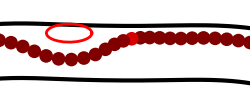
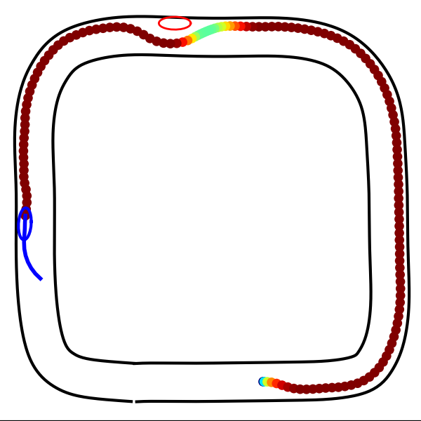
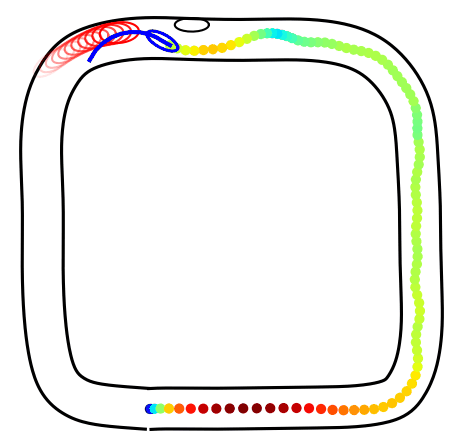
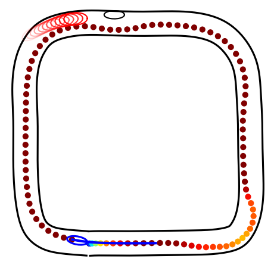
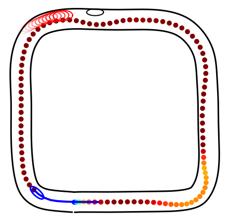
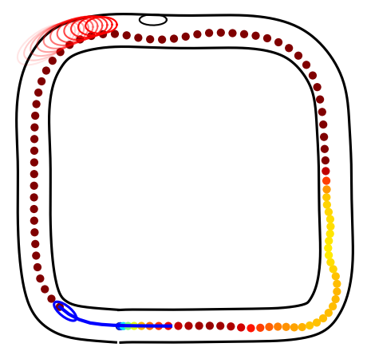
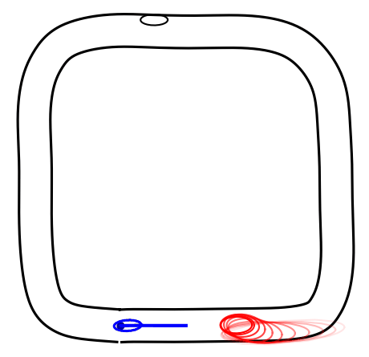
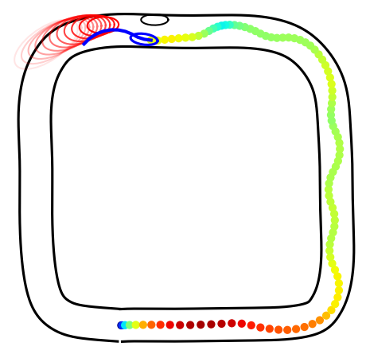
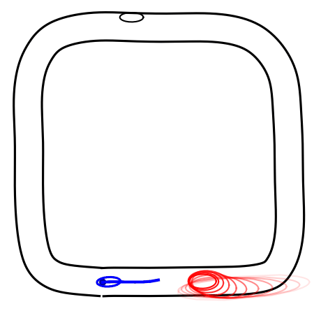

# ECE346 - Lab 2

## Cost analysis
For better understanding of the parameters, we decompose the cost function into the following terms:
$$
\begin{align*}
J = \sum_{k=0}^{N-1}
&\quad w_{vel} \cdot (\textcolor{red}{v_k}- v_{max})^2\\
&+ w_{contour} \cdot (\textcolor{red}{p_k} - p_{ref})^2\\
&+ w_{accel} \cdot \textcolor{red}{a_k}^2\\
&+ w_{delta} \cdot \textcolor{red}{d_k}^2\\
&- w_{theta} \cdot \textcolor{red}{\theta_k}\\
\\
&+ q_{road,1} \cdot \exp((q_{road,2}\cdot(\textcolor{red}{t_k} - w_r))|_{\geq q_{road,2}\cdot(-0.025)}^{\leq 20})\\
&+ q_{road,1} \cdot \exp((q_{road,2}\cdot(-\textcolor{red}{t_k} - w_l))|_{\geq q_{road,2}\cdot(-0.025)}^{\leq 20})\\
&+ \sum_{i=1}^N \gamma^i \sum_{c = 1}^{n_{circ}} q_{obs,1} \cdot \exp((q_{obs,2}\cdot (0 - \text{dist}(\textcolor{red}{\text{self}_k}[c], \text{obs}_i[c])))|_{\geq -0.2})\\
&+ q_{vel,1} \cdot \exp(q_{vel,2}\cdot(0 - \textcolor{red}{v_k}))\\
&+ q_{lat,1} \cdot (\exp(q_{lat,2}\cdot(\textcolor{red}{a_{lat,k}} - a_{lat,\max})) - 1)\\
&+ q_{lat,1} \cdot (\exp(q_{lat,2}\cdot(a_{lat,\min} - \textcolor{red}{a_{lat,k}})) - 1)\\
\end{align*}
$$

with
- $p_k = (?) $ (i.e position on track relative to track border)
- $t_k = \begin{pmatrix} \sin(\phi(\theta_k)) \\ -\cos(\phi(\theta_k))^T \end{pmatrix}^T \begin{pmatrix} x_k - x_{center}(\theta_k) \\ y_k - y_{center}(\theta_k)\end{pmatrix}$ (i.e. projection of difference to unit vector orthogonal to track tangent = L2-norm of difference assuming closest point corresponds to orthogonal projection on track)
- $w_r = \text{track\_width\_R} - \frac{\text{truck\_width}}{2}$ (i.e. distance to track border on the right side)
- $w_l = \text{track\_width\_L} - \frac{\text{truck\_width}}{2}$ (i.e. distance to track border on the left side)
- $\text{dist}(\text{self}[c], \text{obs}_i[c]) = \left\Vert\text{self}[c].\text{center} - \text{obs}_i[c].\text{center}\right\Vert - \text{self}[c].\text{radius} - \text{obs}_i[c].\text{radius}$ (i.e. negative shortest distance between circle $\text{self}[c]$ and $\text{obs}_i[c]$)

*QUESTION: Is $p_k$ and $t_k$ the same?*

## Task 1: Simulation Results

### A. Tuning of iLQR parameters
\#| \| |w_vel|w_contour|w_theta|w_accel|w_delta| \| |q_v&emsp;|q_road|q_obstacle|q_lat| \| |sig_x|sig_y|sig_v|sig_theta| \| |T|N|max_itr| \| |comp_time|remark&emsp;&emsp;&emsp;&emsp;&emsp;&emsp;&emsp;&emsp;&emsp;&emsp;&emsp;&emsp;&emsp;&emsp;&emsp;
-| - |-|-|-|-|-| - |-|-|-|-| - |-|-|-|-| - |-|-|-| - |-|-
base| \| |4|30|0|0.1|0.1| \| |0 / 0|2 / 5|2 / 5|1 / 5| \| |0|0|0|0| \| |1|11|50| \| |15.891|*initial configuration (bypasses with 0.5)*
A1| \| |4|30|0|0.1|0.1| \| |0 / 0|2 / 5|2 / 5|1 / 5| \| |0|0|0|0| \| |**1.5**|**16**|50| \| |24.998|*bypasses with 0.35, almost gets stuck*

base: 
A1: 

### B. Tuning of weights in cost
\#| \| |w_vel|w_contour|w_theta|w_accel|w_delta| \| |q_v&emsp;|q_road|q_obstacle|q_lat| \| |sig_x|sig_y|sig_v|sig_theta| \| |T|N|max_itr| \| |comp_time|remark&emsp;&emsp;&emsp;&emsp;&emsp;&emsp;&emsp;&emsp;&emsp;&emsp;&emsp;&emsp;&emsp;&emsp;&emsp;
-| - |-|-|-|-|-| - |-|-|-|-| - |-|-|-|-| - |-|-|-| - |-|-
base| \| |4|30|0|0.1|0.1| \| |0 / 0|2 / 5|2 / 5|1 / 5| \| |0|0|0|0| \| |1|11|50| \| |15.891|*initial configuration (bypasses with 0.5)*
B1| \| |**10**|30|0|0.1|0.1| \| |0 / 0|2 / 5|2 / 5|1 / 5| \| |0|0|0|0| \| |1|11|50| \| |16.382|*bypasses with 0.7*
B2| \| |**20**|30|0|0.1|0.1| \| |0 / 0|2 / 5|2 / 5|1 / 5| \| |0|0|0|0| \| |1|11|50| \| |15.922|*bypasses with 0.8*
B3| \| |4|**15**|0|0.1|0.1| \| |0 / 0|2 / 5|2 / 5|1 / 5| \| |0|0|0|0| \| |1|11|50| \| |17.713|*bypasses with 0.6, drives more into the other lane*
B4*| \| |4|30|**4**|0.1|0.1| \| |0 / 0|2 / 5|2 / 5|1 / 5| \| |0|0|0|0| \| |1|11|50| \| |11.153|*brakes shortly, bypasses with 1.0*
B5| \| |4|30|0|**0**|0.1| \| |0 / 0|2 / 5|2 / 5|1 / 5| \| |0|0|0|0| \| |1|11|50| \| |16.059|*bypasses with 0.5, stays at slow speed a bit shorter*

base: 
B1: 
B2: 

B3: 
B4: 
B5: 

### C. Tuning of weights in soft constraint
\#| \| |w_vel|w_contour|w_theta|w_accel|w_delta| \| |q_v&emsp;|q_road|q_obstacle|q_lat| \| |sig_x|sig_y|sig_v|sig_theta| \| |T|N|max_itr| \| |comp_time|remark&emsp;&emsp;&emsp;&emsp;&emsp;&emsp;&emsp;&emsp;&emsp;&emsp;&emsp;&emsp;&emsp;&emsp;&emsp;
-| - |-|-|-|-|-| - |-|-|-|-| - |-|-|-|-| - |-|-|-| - |-|-
base| \| |4|30|0|0.1|0.1| \| |0 / 0|2 / 5|2 / 5|1 / 5| \| |0|0|0|0| \| |1|11|50| \| |15.891|*initial configuration (bypasses with 0.5)*
C1| \| |4|30|0|0.1|0.1| \| |0 / 0|**1 / 4**|2 / 5|1 / 5| \| |0|0|0|0| \| |1|11|50| \| |19.007|*bypasses with 0.5, cuts the curves a bit*
C2| \| |4|30|0|0.1|0.1| \| |0 / 0|2 / 5|**1 / 4**|1 / 5| \| |0|0|0|0| \| |1|11|50| \| |18.553|*bypasses with 0.7, comes very close to obstacle*

base: 
C1: 
C2: 

### D. Joint tuning
\#| \| |w_vel|w_contour|w_theta|w_accel|w_delta| \| |q_v&emsp;|q_road|q_obstacle|q_lat| \| |sig_x|sig_y|sig_v|sig_theta| \| |T|N|max_itr| \| |comp_time|remark&emsp;&emsp;&emsp;&emsp;&emsp;&emsp;&emsp;&emsp;&emsp;&emsp;&emsp;&emsp;&emsp;&emsp;&emsp;
-| - |-|-|-|-|-| - |-|-|-|-| - |-|-|-|-| - |-|-|-| - |-|-
base| \| |4|30|0|0.1|0.1| \| |0 / 0|2 / 5|2 / 5|1 / 5| \| |0|0|0|0| \| |1|11|50| \| |15.891|*initial configuration (bypasses with 0.5)*
D1| \| |**10**|30|0|0.1|0.1| \| |0 / 0|2 / 5|2 / 5|1 / 5| \| |0|0|0|0| \| |**1.5**|**16**|50| \| |25.303|*brakes down to 0.6, bypasses with 0.9*
D2| \| |**10**|30|**2**|0.1|0.1| \| |0 / 0|2 / 5|2 / 5|1 / 5| \| |0|0|0|0| \| |**1.5**|**16**|50| \| |12.833|*brakes shortly, bypasses with 1*
D3| \| |**10**|30|**4**|0.1|0.1| \| |0 / 0|2 / 5|2 / 5|1 / 5| \| |0|0|0|0| \| |**1.5**|**16**|50| \| |12.758|*constant speed of 1, drives badly on its lane*
D4| \| |**10**|**60**|**4**|0.1|0.1| \| |0 / 0|2 / 5|2 / 5|1 / 5| \| |0|0|0|0| \| |**1.5**|**16**|50| \| |12.086|*constant speed of 1, drives well in its lane, comes close to obstacle*
D5*| \| |**10**|**60**|**4**|0.1|0.1| \| |0 / 0|2 / 5|**3 / 5.5**|1 / 5| \| |0|0|0|0| \| |**1.5**|**16**|50| \| |13.144|*brakes shortly, bypasses with 1, drives well in lane, keeps distance to obstacle*
D6*| \| |**10**|**60**|**4**|0.1|0.1| \| |0 / 0|2 / 5|**3 / 5.5**|1 / 5| \| |0|0|0|0| \| |1|11|50| \| |10.842|*brakes down to 0.8, bypasses with 1, drives well in lane, keeps distance to obstacle*

base: 
D1: 
D2: 
D3: 

D4: 
D5: 
D6: 

### Discussion
- `w_vel = 10` and `w_theta = 4`: provides incentives for the truck to be close to its maximum velocity and to increase its lap progress.
- `w_contour = 60`: prevents the truck from overly driving on the other lane and cutting the curves. However, this causes the truck to bypass the obstacle more closer than before, since the truck has to deviate from its reference trajectory.
- `q1_obstacle = 3` and `q2_obstacle = 5.5`: prevents the truck from bypassing the obstacle too close by making the barrier function more steep.

---------------

## Task 2: Simulation Results

The goal of tuning parameters is to shape the cost landscape on the track, such that iLQR can efficiently find an trajectory which is also reasonable in practice. Hence, good performance indicators for our parameters are
- **Planning time**: shorter planning time corresponds to less iLQR iterations indicating a more well-behaved cost landscape
- **Trajectory**: better trajectories corresponds to better match between cost landscape and desired behavior on the track

To describe the performance of our trajectory, we use the following terms to refer to particular stages of overtaking another truck:
- **Preparation (prep)**: The process of our truck changing to the second lane. 
- **Initiation (init)**: The process of our truck approaching the other truck on the second lane.
- **Overtaking**: The process of our truck bypassing the other truck.

### A. Tuning of iLQR parameters
*Note: Since the nominal trajectory of the other truck (task 1, experiment D6) only consists of `N = 11` planned states with a time horizon of `T = 1`, we have to use the same iLQR parameters for the planning of our truck.*

### B. Tuning of weights in cost
\#| \| |w_vel|w_countour|w_theta|w_accel|w_delta| \| |q_v&emsp;|q_road|q_obstacle|q_lat| \| |sig_x|sig_y|sig_v|sig_theta| \| |T|N|max_itr| \| |comp_time|remark&emsp;&emsp;&emsp;&emsp;&emsp;&emsp;&emsp;&emsp;&emsp;&emsp;&emsp;&emsp;&emsp;&emsp;&emsp;
-| - |-|-|-|-|-| - |-|-|-|-| - |-|-|-|-| - |-|-|-| - |-|-
base| \| |4|40|0|0.1|0.1| \| |0 / 0|5 / 10|5 / 5|1 / 5| \| |0|0|0|0| \| |1|11|50| \| |13.828|*initial configuration (prep stable, init less stable, overtakes with 1.9)*
B1| \| |**8**|40|0|0.1|0.1| \| |0 / 0|5 / 10|5 / 5|1 / 5| \| |0|0|0|0| \| |1|11|50| \| |10.876|*prep instable, init stable, overtakes with 1.8*
B2a| \| |4|**80**|0|0.1|0.1| \| |0 / 0|5 / 10|5 / 5|1 / 5| \| |0|0|0|0| \| |1|11|50| \| |18.030|*not able to overtake*
B2b*| \| |4|**20**|0|0.1|0.1| \| |0 / 0|5 / 10|5 / 5|1 / 5| \| |0|0|0|0| \| |1|11|50| \| |10.513|*prep stable, init stable, overtakes with 1.8*
B3| \| |4|40|**4**|0.1|0.1| \| |0 / 0|5 / 10|5 / 5|1 / 5| \| |0|0|0|0| \| |1|11|50| \| |15.718|*prep less stable, init stable, overtakes with 1.9, hits the other truck shortly, cuts the curves heavily*
B4| \| |4|40|0|**0.5**|0.1| \| |0 / 0|5 / 10|5 / 5|1 / 5| \| |0|0|0|0| \| |1|11|50| \| |9.970|*prep almost stable, init less stable, overtakes with 1.5, requires more time to overtake, less deceleration*
B5| \| |4|40|0|0.1|**0.5**| \| |0 / 0|5 / 10|5 / 5|1 / 5| \| |0|0|0|0| \| |1|11|50| \| |10.934|*prep almost stable, init less stable, overtakes with 1.8, requires more time than base to plan maneuver*
B6| \| |**6**|40|**2**|0.1|0.1| \| |0 / 0|5 / 10|5 / 5|1 / 5| \| |0|0|0|0| \| |1|11|50| \| |15.666|*prep less stable, init stable, overtakes with 1.8*
B6b| \| |**6**|**20**|**2**|0.1|0.1| \| |0 / 0|5 / 10|5 / 5|1 / 5| \| |0|0|0|0| \| |1|11|50| \| |16.724|*?*
B7*| \| |**6**|40|**2**|**0.5**|0.1| \| |0 / 0|5 / 10|5 / 5|1 / 5| \| |0|0|0|0| \| |1|11|50| \| |15.334|*prep stable, init stable, overtakes with 1.9*
B7b| \| |**6**|**20**|**2**|**0.5**|0.1| \| |0 / 0|5 / 10|5 / 5|1 / 5| \| |0|0|0|0| \| |1|11|50| \| |19.273|*?*

base: 
B1: 

B2a: 
B2b: 

B3: 
B4: 

B5: 
B6: 

B6b: 
B7: 

B7b: 

### C. Tuning of weights in soft constraint
\#| \| |w_vel|w_countour|w_theta|w_accel|w_delta| \| |q_v&emsp;|q_road|q_obstacle|q_lat| \| |sig_x|sig_y|sig_v|sig_theta| \| |T|N|max_itr| \| |comp_time|remark&emsp;&emsp;&emsp;&emsp;&emsp;&emsp;&emsp;&emsp;&emsp;&emsp;&emsp;&emsp;&emsp;&emsp;&emsp;
-| - |-|-|-|-|-| - |-|-|-|-| - |-|-|-|-| - |-|-|-| - |-|-
base| \| |4|40|0|0.1|0.1| \| |0 / 0|5 / 10|5 / 5|1 / 5| \| |0|0|0|0| \| |1|11|50| \| |13.828|*initial configuration (prep stable, init less stable, overtakes with 1.9)*
C1| \| |4|40|0|0.1|0.1| \| |0 / 0|**3 / 10**|5 / 5|1 / 5| \| |0|0|0|0| \| |1|11|50| \| |9.121|*prep stable, init less stable, overtakes with 1.9, bumps into track border few times*
C2| \| |4|40|0|0.1|0.1| \| |0 / 0|**3 / 5**|5 / 5|1 / 5| \| |0|0|0|0| \| |1|11|50| \| |9.583|*prep less stable, init less stable, overtakes with 1.9, bumps into track border more heavily times*
C3*| \| |4|40|0|0.1|0.1| \| |0 / 0|5 / 10|**3 / 6**|1 / 5| \| |0|0|0|0| \| |1|11|50| \| |9.586|*prep stable, init stable, overtakes with 1.8, merges back earlier*
C4| \| |4|40|0|0.1|0.1| \| |0 / 0|5 / 10|**5 / 10**|1 / 5| \| |0|0|0|0| \| |1|11|50| \| |11.291|*prep stable, init less stable, overtakes with 1.8*
C5| \| |4|40|0|0.1|0.1| \| |0 / 0|**5 / 5**|**5 / 5**|1 / 5| \| |0|0|0|0| \| |1|11|50| \| |10.296|*prep instable, init instable, overtakes with 1.8, drives close to track border*

base: 
C1: 

C2: 
C3: 

C4: 
C5: 

### D. Joint tuning
\#| \| |w_vel|w_countour|w_theta|w_accel|w_delta| \| |q_v&emsp;|q_road|q_obstacle|q_lat| \| |sig_x|sig_y|sig_v|sig_theta| \| |T|N|max_itr| \| |comp_time|remark&emsp;&emsp;&emsp;&emsp;&emsp;&emsp;&emsp;&emsp;&emsp;&emsp;&emsp;&emsp;&emsp;&emsp;&emsp;
-| - |-|-|-|-|-| - |-|-|-|-| - |-|-|-|-| - |-|-|-| - |-|-
base| \| |4|40|0|0.1|0.1| \| |0 / 0|5 / 10|5 / 5|1 / 5| \| |0|0|0|0| \| |1|11|50| \| |13.828|*initial configuration (prep stable, init less stable, overtakes with 1.9)*
D1| \| |**8**|40|0|0.1|0.1| \| |0 / 0|5 / 10|**3 / 6**|1 / 5| \| |0|0|0|0| \| |1|11|50| \| |11.291|*?*
D2| \| |4|40|**4**|0.1|0.1| \| |0 / 0|5 / 10|**3 / 6**|1 / 5| \| |0|0|0|0| \| |1|11|50| \| |13.634|*?*
D3| \| |**6**|40|**2**|0.1|0.1| \| |0 / 0|5 / 10|**3 / 6**|1 / 5| \| |0|0|0|0| \| |1|11|50| \| |16.477|*prep instable, init stable, overtakes with 1.9, merges back early*
D4| \| |**6**|40|**2**|**0.5**|0.1| \| |0 / 0|5 / 10|**3 / 6**|1 / 5| \| |0|0|0|0| \| |1|11|50| \| |14.229|*prep stable, init stable, overtakes with 1.9*
D5*| \| |**6**|**30**|**2**|**0.5**|0.1| \| |0 / 0|5 / 10|**3 / 6**|1 / 5| \| |0|0|0|0| \| |1|11|50| \| |15.254|*prep stable, init stable, overtakes with 1.9, touches other truck and track border*
D6| \| |**2**|**30**|**2**|**0.5**|0.1| \| |0 / 0|5 / 10|**3 / 6**|1 / 5| \| |0|0|0|0| \| |1|11|50| \| |16.124|*prep stable, init stable, overtakes with 1.7, does not touch other truck and track border*
D7| \| |**3**|**30**|**2**|**0.5**|0.1| \| |0 / 0|5 / 10|**3 / 6**|1 / 5| \| |0|0|0|0| \| |1|11|50| \| |15.981|*prep stable, init stable, overtakes with 1.8, touches other truck very shortly*
D8| \| |**4**|**30**|**2**|**0.5**|0.1| \| |0 / 0|5 / 10|**3 / 6**|1 / 5| \| |0|0|0|0| \| |1|11|50| \| |16.652|*prep stable, init stable, overtakes with 1.85, touches other truck and track border very shortly*
D9*| \| |**4**|**35**|**2**|**0.5**|0.1| \| |0 / 0|5 / 10|**3 / 6**|1 / 5| \| |0|0|0|0| \| |1|11|50| \| |15.748|*prep stable, init stable, overtakes with 1.75, does not touch other truck and track border*
D9b| \| |**3**|**35**|**2**|**0.5**|0.1| \| |0 / 0|5 / 10|**3 / 6**|1 / 5| \| |**0.05**|**0.05**|**0.05**|**0.05**| \| |1|11|50| \| |18.415|*prep stable, init instable, overtakes with 1.7*
D9c| \| |**3**|**35**|**2**|**0.5**|0.1| \| |0 / 0|5 / 10|**3 / 6**|1 / 5| \| |**0.1**|**0.1**|**0.1**|**0.1**| \| |1|11|50| \| |35.349|*not able to overtake*

base: 
D1: 

D2: 
D3: 

D4: 
D5: 

D6: 
D7: 

D8: 
D9: 

D9b: 
D9c: 

### Discussion
- `w_vel` and `w_theta` larger --> provides incentive for the truck to overtake the other truck (by allowing higher speeds), might regularize cost landscape to more efficient trajectories
- `w_vel` and `w_theta` not too large --> prevents truck to drive too aggressively (e.g. cutting curves, overtaking too closely)
- `w_contour` small --> provides incentive for the truck to overtake the other truck and to merge back later (by allowing larger deviations from reference track)
- `w_contour` not too small --> prevents truck to cut curves too aggressively
- `w_accel` larger --> might regularize cost landscape to trajectories with less acceleration and deceleration
- *`w_delta` larger --> might regularize cost landscape to more straight trajectories with less oscillations (??)*
- `q2_road <> q2_obstacle` (i.e. different rates of exponential increase for road and obstacle constraints) --> might reduce oscillations when computing the trajectory
- `sigma_*` larger --> prevents truck to overtake the other truck too aggressively, but also might prevent truck to overtake the other truck at all (since size of FRS of other truck increases)
- One can see significant decrease in computation time when tuning the barrier function parameters. This indicates that the cost landscape is more well-behaved when using tuned barrier functions.

The oscillation during initiation of the overtaking maneuver comes from the problem that in the beginning there is no explicit incentive for iLQR to find a trajectory such that the truck overtakes the other truck from the left side. Hence, the truck oscillates between overtaking from the right or left side until it gets close enough to the other truck.

### Further experiments
To analyze the generalization ability of the tuned parameters, we make the following experiments using the parameters D6 (a) and D9 (b):
1. Using right lane instead of center line as reference track for truck.
2. Using right lane and overtaking the other truck on a straight part of the track (`initial lap progress = 18`).
3. Using right lane and overtaking the other truck while the other truck bypasses the obstacle (`initial lap progress = 12`).

We observed that providing less incentive for overtaking the other truck (i.e. smaller `w_vel` and `w_theta`) to ensure a safer overtaking maneuver introduces major problems when overtaking from the right track instead of center line. One possible reason is the increased deviation from the reference line required for the overtaking maneuver, which increases the cost by `30 * 0.15 = 4.5`. To address this problem, one can use hybrid systems, which uses a the center line as reference track only for the overtaking maneuver.

E1a: 
E1b: 

E2a: 
E2b: 

E3a: 
E3b: 

### Further ideas
- The overtaking maneuver could be more safe when using a longer nominal trajectory of the other truck which would allow us to plan more ahead.

---------------

## Deployment on truck
Deploying the parameters from the simulations to the truck results into different behavior due to less accuracy, limited computation resources and more uncertainty. Major changes in the setting are
- **Limited computation**: The Jetson is limited to 1 iLQR planning over `N = 6` steps every 0.2s. Hence, we can only replan at most 5 times per second with a time granularity of 0.2s. However, the simulation results are all based on iLQR planning over `N = 11` steps (i.e. replanning 10 times per second with a time granularity of 0.1s).
- **Less accurate controller**: The controller seems to be less accurate in the steering angle resulting in stronger oscillations.

### Parameter tuning
The following was helpful during parameter tuning:
- `w_theta` smaller --> prevents truck to increase velocity unboundedly (since larger weight incentivize velocity to be as large as possible)
- `v_vel` larger and `v_max` smaller --> prevents truck to increase velocity over `v_max` (since larger weight incentivizes to be as close to `v_max` as possible)

### Further ideas
- One can increase the number of planned steps `N` for finer actions (e.g. applying steering action for `dt = 0.1` instead of `dt = 0.2` seconds) while decreasing the number of replans per second (e.g. replanning after every second step instead of after every step).
- One can add an additional circle behind other trucks as an additional backup zone or one can use the minimum distance between any two circle centers approximating the ellipsoids of both trucks for safer overtaking.