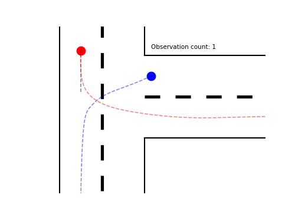
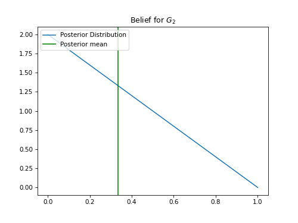
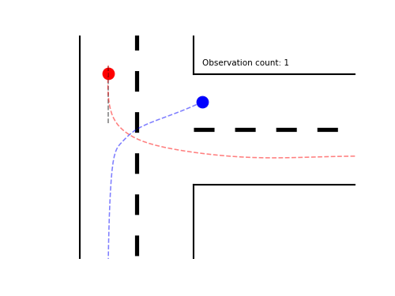
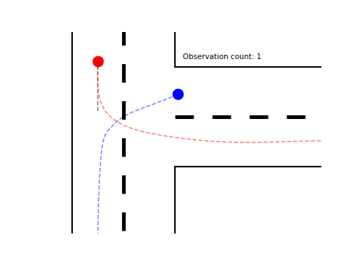
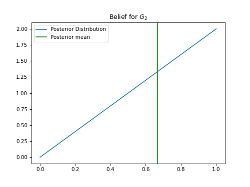

# ECE346 - Lab 2

## Task 2: Simulation Results

### A. Results under ideal observations
In this experiment, our own truck always observes the true state. Hence, the belief about the state of the other truck increases monotonically for the true state.

\#| \| |(G1, forward)|(G2, forward)|(G1, stop)|(G2, stop)| \| |forward|stop| \| |remark
-| - |-|-|-|-| - |-|-| - |-
A0| \| |[0.8, 0.2]|[0.1, 0.9]|[0.5, 0.5]|[0.05, 0.95]| \| |[10, -100]|[-1, -1]| \| |
A1| \| |**[0.9, 0.1]**|**[0.6, 0.4]**|[0.5, 0.5]|[0.05, 0.95]| \| |[10, -100]|[-1, -1]| \| | *less conservative (more prob. on s' = G1)*
A2| \| |**[0.9, 0.1]**|**[0.9, 0.1]**|[0.5, 0.5]|[0.05, 0.95]| \| |[10, -100]|[-1, -1]| \| | *less conservative (more prob. on s' = G1)*
A3| \| |**[0.9, 0.1]**|**[0.9, 0.1]**|[0.5, 0.5]|[0.05, 0.95]| \| |**[10, -10]**|[-1, -1]| \| | *collision (more prob. on s' = G1, higher reward for forward)*
A4| \| |**[0.9, 0.1]**|**[0.9, 0.1]**|[0.5, 0.5]|[0.05, 0.95]| \| |[10, -100]|**[-14, -14]**| \| | *almost collision (more prob. on s' = G1, smaller reward for stop)*

A0:

A1:

A2:

A3:

A4:

### B. Results under more realistic observations
In this experiment, we randomize the observations of our own truck and increase the probability of observing the true state over time. This increases the uncertainty in the belief about the state of the other truck.

\#| \| |(G1, forward)|(G2, forward)|(G1, stop)|(G2, stop)| \| |forward|stop| \| |remark
-| - |-|-|-|-| - |-|-| - |-
B0| \| |[0.8, 0.2]|[0.1, 0.9]|[0.5, 0.5]|[0.05, 0.95]| \| |[10, -100]|[-1, -1]| \| | *too conservative, does not move (higher uncertainty for s' = G1)*
B1| \| |[0.8, 0.2]|[0.1, 0.9]|[0.5, 0.5]|[0.05, 0.95]| \| |**[10, -50]**|[-1, -1]| \| | *conservative, starts moving very late*
B2| \| |[0.8, 0.2]|[0.1, 0.9]|[0.5, 0.5]|[0.05, 0.95]| \| |**[10, -10]**|[-1, -1]| \| | *almost collision*
B3| \| |[0.8, 0.2]|[0.1, 0.9]|[0.5, 0.5]|[0.05, 0.95]| \| |[10, -100]|**[-14, -14]**| \| | *less conservative, starts moving earlier*

B0:

B1:

B2:

B3:

